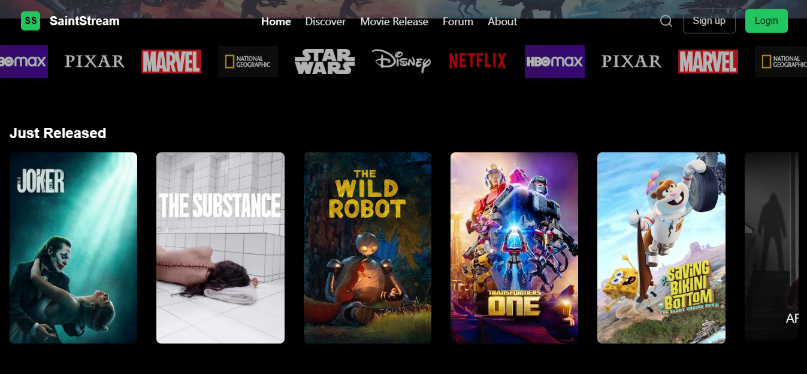

# Cinemasphere - Movie Streaming App
<hr />

This is a [Next.js](https://nextjs.org) project bootstrapped with [`create-next-app`](https://nextjs.org/docs/app/api-reference/cli/create-next-app).

<b>Cinemasphere</b> is a simple movie streaming application developed using <b>React.js</b> and <b>Next.js</b>, powered by the <b>TMDb API</b> for fetching movie and actor data. <br />
The app enables users to browse movies, explore detailed information on films, and view actor profiles, all while ensuring smooth transitions between pages for a seamless user experience.



## Key Features

    Home Screen:
        Displays a list of popular movies and TV series.
        Includes sections for recently released movies and trending films.

    Movie Detail Screen:
        Shows detailed information about a selected movie, including the genre, rating, runtime, and plot overview.
        Displays a list of actors featured in the movie.

    Actor Screen:
        Displays actor profiles, including their biography, filmography, and personal details (such as date of birth and place of birth).
        Allows navigation to movies in which the actor has starred.

    Responsive UI:
        The app is fully responsive, designed using Tailwind CSS, ensuring smooth navigation on both desktop and mobile devices.

    Page Transitions:
        Leveraged Framer Motion for smooth page transitions between the home, film details, and actor details pages.


## Folder Structure

The project follows a modular structure to keep code organized and maintainable:

```` cinemasphere/
├── .next/                  # Next.js build folder
├── app/
│   ├── _api/               # TMDb API configuration and utility functions
│   ├── _components/        # Reusable components (e.g., Header, Footer, Cards)
│   ├── _config/            # Application-wide config, like site-name contact info etc
│   ├── _lib/               # Utility functions like get-genre.ts
│   ├── actors/             # Pages for displaying actor profiles
│   ├── movies/             # Pages for displaying movie details
│   ├── utils/              # Reusable utilities (e.g., types.ts, transition-link.ts)
│   ├── skeleton/           # Loading and error components
│   ├── skeleton/           # Placeholder and skeleton components
│   └── globals.css/             # TailwindCSS and global style files
├── public/                 # Static assets (e.g., images, fonts, icons)
├── .env                    # Environment variables (e.g., TMDb API key)
├── next.config.js          # Next.js configuration
├── tailwind.config.js      # Tailwind CSS configuration
├── package.json            # Project dependencies and scripts
└── README.md               # Project documentation (this file)

````

## Setup Instructions
### Prerequisites

Before starting the project, ensure you have the following installed:

    Node.js (version 16.x or above)
    npm (version 7.x or above)

### Installation
Clone the Repository:

    git clone https://github.com/<your-github-username>/cinemasphere.git
    cd cinemasphere

Install Dependencies: Run the following command to install all required dependencies:

    npm install

Configure TMDb API: Obtain an API key from TMDb. Create a .env file in the root directory and add your API key:

    NEXT_PUBLIC_TMDB_API_KEY=<your-api-key>

Run the Development Server: Start the local development server:

    npm run dev

The app will be available at http://localhost:3000.

Build the App for Production: To build the app for production:

    npm run build

Start the Production Server: After building, you can start the production server:

    npm start

### External Libraries and Plugins

The following external libraries were used in the project:

- <b>axios</b>: For making HTTP requests to the TMDb API to fetch movie and actor data.
- <b>framer-motion</b>: For smooth animations and page transitions.
- <b>lucide-react</b>: Icon library for displaying consistent and scalable icons throughout the UI.
- <b>react-slick</b>: Used for implementing carousels to showcase movies and series in various sections.
- <b>Tailwind CSS</b>: Utility-first CSS framework for styling the user interface, ensuring a clean and responsive design.

### TMDb API Usage

To fetch the movie and actor data, I used the TMDb API. Below are the key endpoints used:

    Fetch Popular Movies:
        Endpoint: /movie/popular
        Used in the Home Screen and Film Screen to display the most popular movies.

    Fetch Movie Details:
        Endpoint: /movie/{movie_id}
        Used in the Movie Detail Screen to show detailed information about the selected movie.

    Fetch Actor Details:
        Endpoint: /person/{person_id}
        Used in the Actor Screen to display actor details and their filmography.

### Challenges Faced
1. API Rate Limiting:

    Issue: When fetching data from the TMDb API, I encountered rate-limiting issues during testing with frequent API requests.
    Solution: I implemented caching using Next.js’s built-in API routes to minimize repeated API calls.

2. Handling Large Image Sizes:

    Issue: Some movie poster images were slow to load on lower bandwidth connections.
    Solution: I used Next.js’s next/image component to optimize image loading and implemented lazy loading to improve performance.

3. Page Transitions:

    Issue: Integrating smooth transitions between pages while maintaining good performance.
    Solution: I used Framer Motion for page transitions and ensured animations were only triggered when necessary, keeping performance high.

### Future Improvements

    Search Functionality:
        Currently, there’s no search functionality for movies or actors. In the future, adding a search feature would improve the user experience.

    Favorites & Watchlist:
        I plan to add user authentication and allow users to add movies to their favorites or watchlist for easy access.

    Caching & Offline Mode:
        Implementing better caching for API results and enabling offline mode using service workers would further improve app performance.

### Known Bugs & Issues

    API Errors:
        Occasionally, the API returns empty responses for certain actor profiles.
        Temporary Fix: Added a fallback message for missing data.
        API structure: The structure of TMDB is a bit different from the initial designs.

    Page Load Time:
        On slower networks, the home page takes a few seconds to load because multiple API requests are made simultaneously. Implementing loading skeletons and prefetching data for a better UX would help.

## Learn More

To learn more about Next.js, take a look at the following resources:

- [Next.js Documentation](https://nextjs.org/docs) - learn about Next.js features and API.
- [Learn Next.js](https://nextjs.org/learn) - an interactive Next.js tutorial.

You can check out [the Next.js GitHub repository](https://github.com/vercel/next.js) - your feedback and contributions are welcome!
